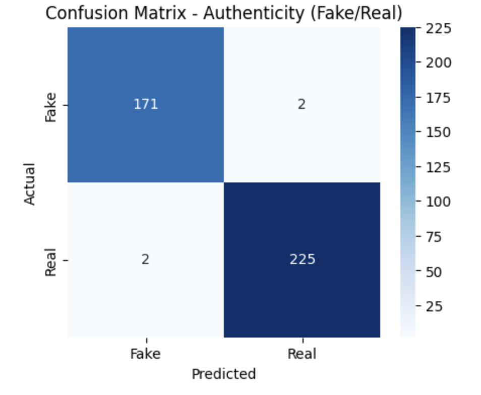
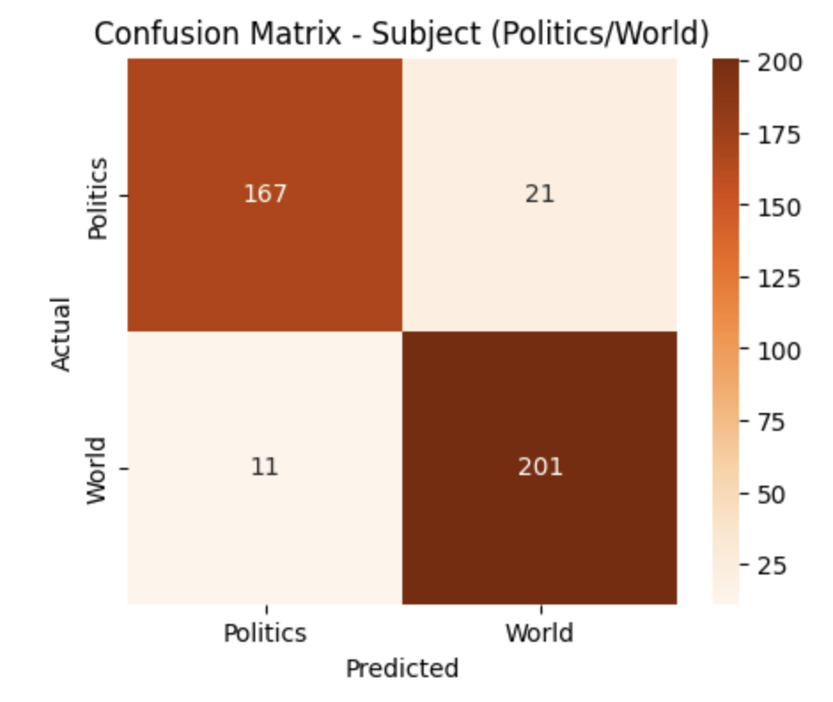
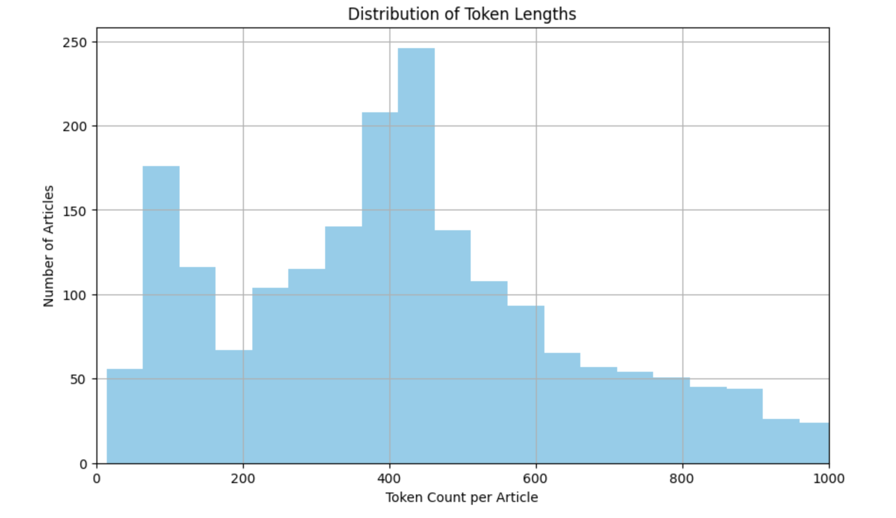

# 📰 Fake News Classification

A dual-classification BERT model that determines both the authenticity and the topic of a news article.

---

## Overview

In 2025, I participated in MIT FutureMakers, a six-week program in collaboration with SureStart to teach students about data analysis, mobile app development, and deep learning. Our team completed three practice neural networks before creating a final capstone project; this was the third of the three networks that we created. The Fake News dataset is another popular set for those learning to get started with MLP's and Neural Nets, but the primary goal of this project was to learn supervised learning with text data and how to utilize the BERT model in the process. The network learns to categorize the news articles into two different categories: the validity of the article (real or fake) and the topic of the article (world news or politics), Cells were set aside for Optuna and ExAI methods to see where the model was coming up with inconsistencies, and the accuracy was determined via graphs and reports.

---

## Dataset

- **Source:** [Kaggle Fake News Detection Dataset](https://www.kaggle.com/datasets/emineyetm/fake-news-detection-datasets)
- **Size:** 44,898 articles, 21,471 real sources and 23,481 fake sources
- **Features:** Title, text, subject, date
- **Target classes:** *Real news*, *Fake news*, *Politics news*, *World news*

---

## Results

With a 400-sample test set, the validity classifer achieved 99% accuracy while the topic classifier reached 91.75%—displaying the contrast between grasping writing style and grasping subject matter.

### Confusion Matrix (Fake/Real)



### Classification Report (Fake/Real)

| Class | Precision | Recall | F1-Score | Support |
|---|---|---|---|---|
| 0.0 (Fake) | 0.9884 | 0.9884 | 0.9884 | 173 |
| 0.1 (Real) | 0.9912 | 0.9912 | 0.9912 | 227 |
| Accuracy |  |  | 0.9900 | 400 |
| Macro Avg | 0.9898 | 0.9898 | 0.9898 | 400 | 
| Weighted Avg | 0.9900 | 0.9900 | 0.9900 | 400 |

### Confusion Matrix (Politics/World)



### Classification Report (Politics/World)

| Class | Precision | Recall | F1-Score | Support |
|---|---|---|---|---|
| 0.0 (Politics) | 0.8942 | 0.9442 | 0.9185 | 197 |
| 0.1 (World) | 0.9427 | 0.8916 | 0.9165 | 203 |
| Accuracy |  |  | 0.9175 | 400 |
| Macro Avg | 0.9185 | 0.9179 | 0.9175 | 400 | 
| Weighted Avg | 0.9188 | 0.9175 | 0.9175 | 400 |

---

## Key Takeaways

- **Weighted classes** were used for the authenticity classifier due to the imbalance after removing duplicated articles; by adjusting the loss calculations, the penalty for getting the minority group incorrect (fake news) was much greater.
   - Class weighting wasn't implemented for the topic classifier, which (other than the natural overlap between politics and world news) may be part of the reason that it wasn't as accurate.
- When searching for the best hyperparameters, **Optuna** decided that the ideal learning rate was 3.46e-5 and the ideal batch size was 4, determining how many samples the model views before updating.
   - The average F1 score increased from 0.8963 (across both tasks) to 0.9900 and 0.9175 after implementation.
- Explainable AI methods (such as **LIME**), which help to explain the results produced by algorithms found that the term "reuters" was the greatest indicator of whether or not an article was real or fake at +0.5075.
   - This is because the original dataset sourced most, if not all of its real articles from Reuters, and the tag denoting this within each article wasn't removed. It's very likely that the miscategorized fake articles included this term in passing.
 
<br>

<sub><i> Token frequency distribution within the dataset </i></sub>

---

## Setup

### Prerequisites

```bash
pip install -r requirements.txt
```

### Running the Notebook

```bash
git clone https://github.com/eliasangelss/fake-news.git
cd fake-news
jupyter notebook model.ipynb
```

---

## Project Structure

```
fake-news/
├── model.ipynb       # Includes analysis, modeling, evaluation, and my notes
├── newsData          # Folder containing the dataset
├── requirements.txt
└── README.md
```

---

## Model Architecture

```
Input (tokenized text → input_ids + attention_mask)
  → BertModel (bert-base-uncased)
  → [CLS] token embedding (768-dim)
  → Linear(768 → 1) Authenticity Head
  → Linear(768 → 1) Subject Head
```

- **Train-Test Split:** 1600 train / 400 test
- **Optimizer:** AdamW (lr = 3.46e-5)
- **Loss:** BCEWithLogitsLoss, pos_weight applied to authenticity head 
- **Regularization:** Early stopping (patience = 2 epochs, batch_size = 4)

---

## Tools & Libraries

- Python, Jupyter Notebook, IPython
- PyTorch, Transformers, deep_translator
- scikit-learn, pandas, NumPy
- matplotlib, seaborn
- Optuna, LIME

---

## License

MIT
